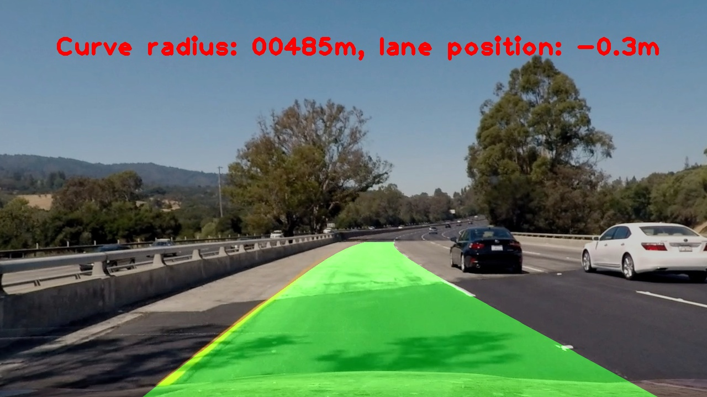
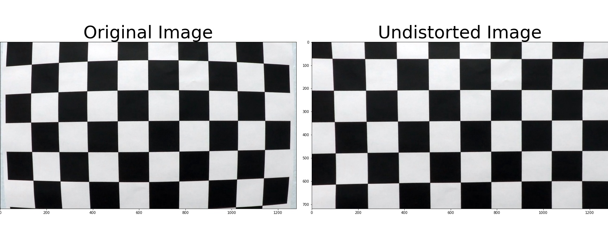
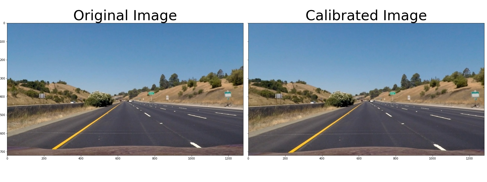
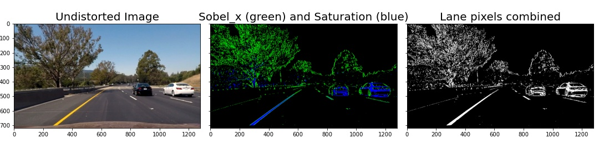
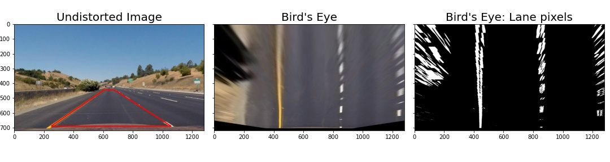
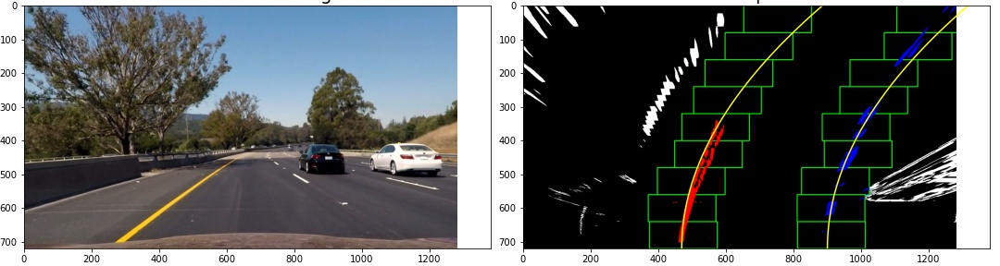
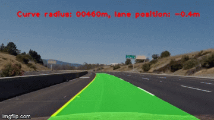

# **My Advanced Lane Finding**

## **Overview**
This exercise consisted of: 
**
One-time camera [calibration](#camera-calibration)
**
* Determine the camera calibration from distorted chessboard pictures.

**
Lane finding pipeline for [pictures](#pipeline-single-images) & [videos]()
**
* Apply the previously found distortion correction to images/videos.
* Use opencv sobel filters to select likely lane markings
* Transform the image to a birds-eye view
* Geometrically select further likely lane markings and fit a curved road model
* Extract road curve radius and in-lane vehicle position from road model
* Project lane model on original ego-view image 
* Display values for road radius and vehicle position

---
## Details 

### Camera Calibration

The camera calibration was performed in its own notebook:  [Camera-Calibration.ipynb](Camera-Calibration.ipynb). 

Camera calibration removes lense effects such as a fish-eye distortion. In order to do so, distortions are determined from raw images of objects with known real-life geometries such as straight grids of chessboard images. Once distortions are determined, their inverse is applied to raw images to gain calibrated undistorted images. 

Mathematically, we approximate that an ideal camera $C_I$ takes a 3D object $O$ and produces an ideal image $I_I$:

$$ I_I = C_I * O$$

However, any real image $I_R$ is taken by a real camera $C_R$. We approximate the real camera $C_R$ as a factorization of the ideal camera $C_I$ and distortions $D$:

$$ I_R = C_R * O \approx D * C_I * O = D * I_I$$

Assuming $D$ is invertable, we can recover the ideal image by applying the inverse distortions on our real image:

$$ I_I \approx D^{-1} * I_R \tag{1} $$

Opencv provides powerful tooling for camera calibration. Distorted, bent grids in real images of chessboards are reconstructed from finding the corners where white and black squares are intersecting with the function `findChessboardCorners()`. The functions takes as input the image and the number of horizontal and vertial corners to be found and returns the coordintates of the corners. In our notebook, the first cell [Find Corners](Camera-Calibration.ipynb#Find-Corners) does exactly this and visualizes the results. Noteably, the function fails for three of the twenty provided calibration images. Here, the image does not capture the full chessboard and the algorithm rightfully fails to detect the corners outside of the image. The found corners represent $I_R$ in Eq.&nbsp;(1) above. 

The known chessboard geometry allows us to specify ideal coordinates of the chessboard corners. Here, we arbitrarily choose $(0, 0, 0)$ to $(8,5,0)$ for the nine by six corners. 

By default, opencv determines radial and tangential distortions and approximates them with three and two coefficients, respectively. In the following, $r^2 = x^2 + y^2$.
Radial distortion: 

$$
x_{\mathrm{distorted}} = x (1 + k_1r^2 + k_2r^4+k_3r^6) \newline
y_{\mathrm{distorted}} = y (1 + k_1r^2 + k_2r^4+k_3r^6)
$$

Tangential distortions:

$$
\begin{aligned}
x_{\mathrm{distorted}} = x &+ p_12xy &+ p_2\left(2x^2+r^2\right) \\
y_{\mathrm{distorted}} = y &+ p_1\left(2y^2+r^2\right) &+ p_2 2xy 
\end{aligned}
$$

The calibration procedure yields the following parameters:

 Parameter | Value     
 --- | ---
 k1 | -0.25
 k2 | -0.024 
 p1 | -0.0011
 p2 | 0.00035
 k3 | -0.0026

Using these distortion coefficients to undistort taken images reveals visually appealing results. Clearly, distortions in checkboard patterns are removed and grid lines are rectified:

  

### Pipeline single images
For development of the lane-finding pipeline, we first work with single images and a later stage adapt the single-image pipeline to videos. The single-image pipeline was implented in the [Pipeline-TestImages.ipynb](Pipeline-TestImages.ipynb) notebook.

#### 1. Distortion Correction
Since we're dealing with raw camera data, the images need to be corrected for camera-specific distortion effects. We use the <a href="#params">parameters</a> obtained from our calibration procedure. The implementation can be found in the [Distortion correction](Pipeline-TestImages.ipynb#Distortion-correction) paragraph of the notebook.

In order to test our calibration procedure, we should again check pictures of objects which have known geometries such as straight lines. The following figures show a white horizontal straight line on the asphalt in front of the ego-vehicle's hood which appears distorted, i.e. bowl-shaped bent, in the original raw image (left-hand side in the following figure) and is rectified and straigth in the calibrated image (right-hand side in the following figure).

#### 2. Identifying lane pixels
In the pursued opencv approach to find the lane, we must identify pixels in images representing lane markings. Here, we use combinations of color transforms, thresholding, and edge detection to do so. In the paragraph [Lane Pixels](Pipeline-TestImages.ipynb#Lane-Pixels), we see the color transform from RGB to Hue (H), Lightness (L), and Saturation (S). We use a Sobel filter in horizontal direction on the L channel and scale the resulting values per image such that the maximal derivative of each image equals to 255. On these scaled horizontal Sobel gradients, we apply a threshold window with moderate values. In parallel, we threshold the S channel and select high-saturation pixels with saturations >=67%. In the end, we accept pixels which were selected through either the horizontal Sobel gradients or the saturation thresholding. 

The following figure shows the undistorted RGB image (left), the pixels selected through horizontal Sobel gradients (center, green) and saturation (center, blue), as well as their combination (right). One recognizes the complementary nature of the two approaches: high saturation thresholding is particular successful for lane markings close to the ego vehicle, both for yellow lane markings (shown below) as well as white lane markings (other pictures not shown). Unfortunately, objects other than lane markings appear in the selected pixels as well: see the other other vehicles and trees in the figure below. Nonetheless, the code does an excellent job of discriminating the lane markings against the asphalt road. 

#### 3. Perspective transform

Part of our task is to identify the lane's curvature radius. This and assigning pixels to a lane model is simpler in a bird's eye view. We could integrate perspective effects into our lane model and continue to work with ego-view images. However, we prefer to separate the two for simplicity. 

To carry out the perspective transform, we again make use of knowing the geometry of objects appearing in the ego-view image. In particular, we choose the rectangular shape of a straight lane segment which appears trapezoidal in an ego-view, see the figure below and [this notebook cell](Pipeline-TestImages.ipynb#Warp-image:-bird's-eye-view). 

#### 4. Fit lanes

Given the identified likely lane marking pixels, we need to fit a lane model to these lane markings. The exercise suggests to fit a second-order polynomial to both, right and left, ego-lane delimiters independently:

$$
x_l = a_1 + b_1*y + c_1*y^2,\newline
x_r = a_2 + b_2*y + c_2*y^2,
$$
with $y$ being the vertical pixel coordinate, i.e. the longitudinal distance from the ego vehicle, $x_l(y)$ the left lane boundary, and $x_r(y)$ the right lane boundary. We deviate from this suggestion. 

*Combined left and right model* 
The left and right lane delimeters are not independent. Rather, they always run parallel to each other and are simply offset by the - a priori unknown - lane width. The left and right lane boundaries' tilt $b_1, b_2$ and curvature $c_1, c_2$ are the same and can be unified, leading to:

$$
x_l = a_1 + b*y + c*y^2,\newline
x_r = a_2 + b*y + c*y^2.
$$
The parameter reduction allows for more stable lane finding and avoids unphysical results. 

*Coordinate transform to avoid tilt* 
At all times, the car is following the lane's direction: 
$\mathrm{d}/\mathrm{d}x~x_{l,r}(y_{\mathrm{car}}) = 0$. (In ADAS scenarios, which this is clearly aimed at, lane keeping is not active when changing lanes.) Naively, the $y$ coordinate is zero at the top of the image and takes the value of the image's height $h$ at the vehicle's position. We perform a coordinate transform $\tilde{y}=h-y$ and omit the tilde in the following such that the vehicle is positioned at $y=0$. For implementation reasons, we also redefine $\tilde{a_2} = a_2-a_1$ to be the lane width and again omit the tilde in the following. This simplifies our lane model further to: 

$$
\begin{aligned}
x_l &= a_1     &+ c*y^2,\\
x_r &= a_1+a_2 &+ c*y^2.
\end{aligned}
\tag{2}
$$

*Geometrical assignment of pixels to lane boundaries* 
So far, lane marking pixels do not belong to either the left or right lane boundaries. A criterion is needed to do so. The simplest would be to assign pixels in the left half of the picture to the left lane boundary and accordingly for the right. However, this approach will fail in situations with high curvatures where lane boundaries will easily cross the image center. Without prior knowledge, we perform a sliding window technique to assign pixels to left and right lane boundaries. 

It was suggested to sum up pixels vertically in the left and right half of the image and take the $x$ coordinate where the sum is maximal as a starting point for the lane boundary. We alter this procedure. We observed that in a curved scenario, the suggested formalism puts too much weight on distant lane markings, biasing the lateral postition towards the curved far end which differs from the lateral lane marking position close to the ego vehicle. With lesser importance, we also note that the bird's-eye perspective transform enlarges distant lane marking pixels, which generally leads to increased noise for distant pixels. Both considerations lead us to adapt the vertical sum to include a linear weight-term which is unity at the ego-vehicle's position and vanishes at $y_\mathrm{half}$, the image's vertical center. Laterally, we evenly divide the image and restrict the sums to the second and third quarter only which allows us to ignore further lane markings from adjacent non-ego lanes. 

Having found a starting position for the left and right lane boundary, we draw nine vertically stacked, rectangular windows of width 100 pixels. The first window is laterally centered at the previously found starting position. All pixels wihtin the left or right window are assigned to the left or right lane boundary, respectively. If a minimum of 50 active lane marking pixels falls in this window, their average lateral position is determined and next window is centered at this average pixel position adjusted by a momentum term. The momentum term is inspired by deep learning optimization techniques often featuring a momentum term; it captures the difference of a windows center and the average position of its pixles and as such is an approximation of a first derivative or momentum of the lane's lateral position. 

All pixels within the sliding windows are fit with our lane model of Eq.&nbsp;(2). 

The figure below visualizes the discussed steps. For the python implementation, see [this notebook cell](Pipeline-TestImages.ipynb#Fit-lanes)

#### 5. Curve radius and ego-vehicle position in lane
Love and Rainville in "Differential and Integral Calculus" (see p. 77 [here](https://archive.org/details/differentialand00lovegoog/page/n100/mode/2up)) derive the curvature $\kappa$ of a function $f$ to be 

$$
\kappa = \frac{|f''|}{(1+f'^2)^\frac32}
$$
and identify the curve's radius $\rho$ as

$$
\rho = \frac1\kappa = \frac{(1+f'^2)^{3/2}}{|f''|}
$$

In our case:

$$
\begin{aligned}
x(y) &= a_1 (+a_2)    &+ c*y^2 \\ 
x'(y) &= &2c*y \\
x''(y) &= &2c 
\end{aligned}
$$

We appreciate our lane model and its coordinate system, leading to:

$$
\begin{aligned}
\rho(y) &= \frac{\left(1+(2cy)^2\right)^{3/2}}{|2c|} \\
\rho(y=0) &= \frac{1}{|2c|} \tag{3}
\end{aligned}
$$

While Eq.&nbsp;(3) gives the curve's radius in pixel values, we're interested in real-life units. To start with, we make ourselves aware of the units of $c$ in our lane model Eq.&nbsp;(2):

$$
x_{l,r}[p_x] = \ldots + c[???] *(y[p_y])^2,
$$
where $p_x$ should represent *pixels in horizontal direction* and $p_y$ should represent *pixels in vertical direction*. We identify the unit of $c$ to be $p_x/p_y^2$. To arrive at a curve radius, we must convert both vertical and horizontal pixels to real-life distances. Again, we make use of the knowledge of properties of real-life objects captured in the images for the unit conversion. Legislature puts the highway lane width at 12ft, see [this reference](https://law.resource.org/pub/us/cfr/ibr/001/aashto.green.2001.pdf#page=361). We measure the lane width in pixels in the bird's-eye transformed "straight-lines1" test image and arrive at a horizontal conversion factor of $\frac{3.658}{410} \frac{m}{p_x}$. Simarly, we determine the vertical length of lane markers - according to legislature 10ft - and end up with the vertical conversion factor to be $\frac{3.048}{41}\frac{m}{p_y}$. We note some variation in using various known distances and suggest dedicated pictures for length calibration with accurately measured physical objects.

In line with expectations, we determine the curve radius of provided test images to be larger than several thousands of kilometers for visually straigth lanes. For the curved test images, we determine a radius of roughly 400-500m and underestimate the known true radius. We also determine the vehicle's position within the ego-lane to be up to 40cm off the center of the lane. Visually inspecting the images qualitatively confirms the offsets as algorithmically determined. 

For details, see [this cell](Pipeline-TestImages.ipynb#Determine-Curve-Radius) of the notebook.

#### 6. Visualizing Results

To visualize our found lane, we draw the lane in its bird's-eye view and use the perspective transform in its inverse to translate the bird's-eye lane to an ego-view lane. We then stack the ego-view camera image with the ego-view lane image. The result is shown in the following figure, the code can be found in [this cell](Pipeline-TestImages.ipynb#Draw-on-original-image).

---

### Pipeline (video)

Lastly, we run the full lane detection pipeline on a video. Wrt. the single image pipeline, we adapt the [4. Fit lanes](#4.-Fit-lanes) step. In this case of subsequent video frames, we use the lane found in the previous frame - rather than the sliding window technique - to geometrically select the lane marker pixels. Noteworthy, the general good quality of the lane model allows to half the horizontal width of the search window compared to the sliding window technique. The implementation falls back to the sliding window technique for the first frame and in case of a bad fit of the lane model (which is not triggered in our test video).

Click the gif for the full video:
 

<video width="640" height="480" id="vid1" controls>
    <source src="output_videos/project_video_origlanes.mp4" type="video/mp4">
</video>

---

### Discussion and Limitations

This lane finding project teaches a lot on camera calibration, perspective transforms, and computer vision using opencv. As can be witnessed in the output images and videos, the lane finding pipeline delivers very good results with moderate development effort. The capability of the lane finding algorithm developed here appears comparable to the newest Volkswagen "Digital" Golf of late 2020. Limitations of the pipeline quickly appear when tried out on the provided challenging videos. 

In the "challenge_video.mp4", the ego lane's asphalt has two different colors. The pipeline picks up the transition from one type of asphalt to the other as a lane marking. Consequently, the outputted lane is distorted such that the vehicle would be steered into the concrete barrier separating the oncoming traffic. In order to remediate the situation, we should adjut the opencv lane marker identification code. 

The "harder_challenge_video.mp4" has a very difficult to handle lighting situation with frequent, rapid changes from sunny to shaded road and quick changes from hard left to hard right turns. While initially providing decent results, the pipeline code struggles to identify lane markings further into the video and the reset of the lane model with the sliding window technique is triggered several times. The regularization effect of using the previous frame's lane model to geometrically select lane marker pixels within a narrow search window is clearly too strong: the lane does not follow the quick changes from left and right turns fast enough. As a first attempt one should widen the search window in this rural road setting. One also spots instances where the lane width turns unreasonably small. Here, a minimal lane width, i.e. a lower limit on the $a_2$ parameter in the lane model fit, will provide significant improvement. 
